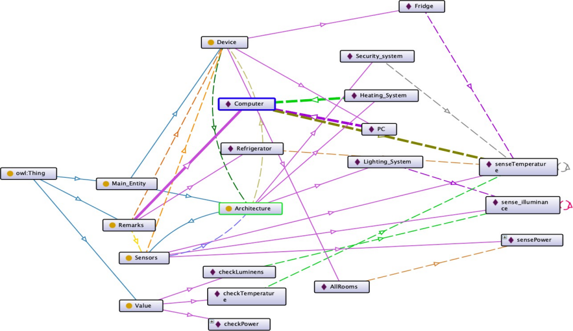
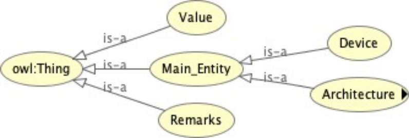

## Cybersecurity ontology for Smart Devices (Semantic Web Technologies)

This ontology is called a sensor network ontology for a smart home. It is a basic simulation for home use for systems such as Home Appliances, Heating systems and Security systems. All devices are connected to communicate and there is a main system control (master node).

### SEMANTIC WEB

The structured architecture that enables applications to share information across many domains, with a focus on business and government systems. The focus of web semantic systems is on the framework for resource description (RDF), which incorporates XML applications of URI types.

#### The Internet of Things (IoT) and Cloud Services in the Smart Household

IoT describes a prospect where a wide range of sensory devices and objects surrounding, like sensors, RFID tags, placement amenities, and portable devices, will be linked to the Internet, allowing these artifacts and gadgets to interact, work cooperatively, and interact in socioeconomic, ecological, and user contexts to accomplish project goals.

- Cloud hosting is used to alter home care and applications inside the smart home arena. While more home systems from multiple retailers are outfitted with the on components that can connect to the Internet, innovative approaches for combining advanced home routers, associated devices, on- board components in home devices, household routers, and cloud computing for developing beautiful clouds have emerged.

#### Cloud Architecture Model with Multiple Layers for IoT-based Home Automation

With an ever-increasing number of data outlets in home automation, organized numerous sensor systems and control processor architectures attached via numerous wireless equipment, the primary problem comprises of accumulating, incorporating, and handling the massive amount of data generated by such sources in order to convert it into the knowledge required by smart services offered in the modern home.

  

Figure 1: The IoT-based smart home's tiered cloud architecture paradigm.

The layered design of our suggested cloud architecture paradigm for IoT-based smart homes is depicted in Figure 1. In general, various levels serve distinct functions, while the lower levels serve as basic supports for the higher levels. Various IoT devices, such as sensors, controllers, controls, cell phones, and other household appliances, interact by merging behind a single cloud-based system and utilizing available wireless like Bluetooth, ZigBee, Wi-Fi, LTE, etc., and cable mobile networks.

### Smart home automation concept to its lowest level

  

#### Ontology Model for Smart Home devices

This ontology is called a sensor network ontology for a smart home. It is a basic simulation for home use for systems such as Home Appliances, Heating systems and Security systems. All devices are connected to communicate and there is a main system control (master node).

  

**The main classes**

- Main Entity: a generic class for the physical items which is subdivided into the ontology Architecture and Devices.
- Sensor: a subclass of the architecture for sensing.

The Device class has three systems which are All Rooms, Fridge and PC. The Architecture is made of 3 individuals; Heating, Lighting and security systems

**Object Properties include**

- connectedSystems: shows the relationship between a Device and Architecture
- observedAttribute: displays which attributes is observed
- observes: the relationship between a sensor and an attribute that the sensor observes
- onDevice: relationship between a system; like an example a Sensor and a device.
- remarkedBy: show the relationship between a remark and a Sensor
- attributeOf: shows the relationship between the Architecture and the Device

  

Figure 2 describes the Object property of observes

**Data Properties include**

- remarkValue: displays the value that the sensor generated
- hasType: a property unit.
- Mode: displays which mode is applied to the device
- Low/High Safety: describes the max and min limits of the expected value for a Sensor

  

Figure 3: describes the Data properties

  

Figure 4: shows the Individuals are created for each class, and each class can have multiple individuals from other classes

### SPARQL Query

The SPARQL Protocol is an RDF query language for databases that is used to gather and act on reserved data, which is represented as the Resource Description Framework's Object, Predicate, and Subject (RDF).

  

The project summarizes and describes the basic ontology scheme of a Smart home security Ontology using device sensory application process. The project was design using a software called Protege using OWL, RDFS, RDF, RDF GRAPH executing SPARQL queries to collect and manipulate data.
